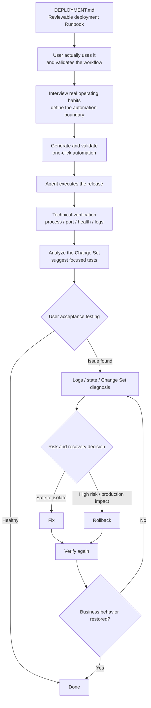

<div align="center">

# dsh-ssh-files-sidebar

**An integrated Remote SSH workspace and closed-loop deployment agent for DeepSeek Harness**

One plugin for the right-side workbench, SSH hosts and terminal, Remote Workspace, SSH Files, remote vision/OCR, deployment runbooks, automation scripts, and agent-operated delivery.

[](https://github.com/qigelunbiya/dsh-ssh-files-sidebar/actions/workflows/build.yml)
[](./package.json)
[](./LICENSE)

[简体中文](./README.md) · **English**

</div>

---

## What this project is

`dsh-ssh-files-sidebar` is more than a file sidebar and more than a thin SSH command wrapper. It combines the remote-development and deployment pieces around DeepSeek Harness into one coherent workflow:

- **One top-level plugin**: internally composes `dsh-better-sidebar`, `@linxin666/dsh-ssh`, and `dsh-rw`.
- **One SSH configuration**: hosts and credentials are shared through `~/.dsh/dsh-ssh.json`.
- **Local + remote execution planes**: source code, builds, and local artifacts stay in the LOCAL Workspace; server operations stay locked to the single SSH target of the current conversation.
- **VS Code-like SSH Files**: browse, edit, preview, upload, download, rename, delete, and multi-select remote files.
- **Agent-readable remote content**: direct remote image inspection plus a local OCR path on supported Windows/macOS environments.
- **Deployment that matures from documentation to a closed loop**: Runbook first, automation later, then agent-operated deploy, verification, hand-off, diagnosis, and recovery.

> Core principle: **make the real workflow visible and stable first, then increase automation deliberately.**

## Closed-loop deployment

The current deployment model is centered around this lifecycle:



At maturity, a normal deployment is no longer “the Agent prints commands and the user runs them manually.” Instead:

1. the Agent resolves the release inputs and checks the environment;
2. it executes within the already-confirmed automation boundary;
3. it independently verifies the service instead of trusting a script exit code;
4. when reliable Git/Workspace evidence exists, it summarizes what changed;
5. it derives a focused user test plan from the real change set;
6. successful user acceptance closes the release;
7. reported issues enter a diagnosis loop;
8. when risk grows, recovery takes priority and the user can choose to continue diagnosis, receive rollback commands, or let the Agent perform the rollback;
9. fixes and rollbacks are verified again before the loop is closed.

See [Deployment Runbook](./docs/deployment-runbook.md) for the full behavior model.

## Automation maturity: not every Runbook command belongs in a script

`DEPLOYMENT.md` is the complete operational knowledge base, but **a command being documented does not imply that the user wants it automated**.

The deployment model has four preparation stages and one closed-loop stage:

| Stage | Goal |
| --- | --- |
| 1. Runbook | Capture the real workflow in a readable, reviewable `DEPLOYMENT.md` |
| 2. User validation | The operator uses it, adjusts it, and explicitly considers it stable |
| 3. Habit interview | Decide which steps are automated, manual, external hand-offs, or outside the normal run |
| 4. One-click automation | Automate only the subset the user actually wants automated |
| 5. Agent closed loop | Execute, verify, hand off, diagnose, and recover |

Before scripting, the Agent builds an automation coverage map:

```text
AUTOMATE             → include in the script
KEEP MANUAL          → keep as an operator action
EXTERNAL / HAND-OFF  → handled by another tool or process
NOT IN NORMAL RUN    → retained in the Runbook, omitted from the normal one-click path
```

The goal is not maximum automation. The goal is **automation that matches how the operator really works**.

## Core capabilities

| Capability | What it does |
| --- | --- |
| Better Sidebar | Internally integrates the right-side workbench and Files / Editor / Terminal / Browser surfaces |
| SSH Host & Terminal | Reuses `@linxin666/dsh-ssh` host management, Web Terminal, SFTP, and tunnels |
| Remote Workspace | Reuses `dsh-rw` so Read / Write / Edit / Glob / Grep / Bash can transparently operate a remote Workspace |
| Linked SSH | Lets a local source Workspace bind one session-scoped SSH target for local development + remote deployment |
| SSH Files | Remote tree, editor, preview, multi-select, upload/download, inline rename, directory creation, and delete |
| Vision / OCR | Reads remote images directly for visual analysis; text-only flows can use system OCR where supported |
| Deployment Runbook | One project-owned `DEPLOYMENT.md` covering LOCAL / TRANSFER / REMOTE / VERIFY / ROLLBACK |
| Automation Maturity | Validates the Runbook, interviews user habits, defines coverage, then creates automation |
| Closed-loop Delivery | Agent executes validated automation, verifies the service, recommends tests, accepts feedback, diagnoses, and rolls back when appropriate |
| Session Safety | One SSH target per conversation; high-risk actions still use Harness-native approvals |

## Architecture

```text
One top-level install: dsh-ssh-files-sidebar
│
├─ dsh-better-sidebar (integrated)
│  ├─ right-side workbench
│  ├─ Files / Editor / Terminal / Browser
│  └─ /sidebar/* host routes + client shell
│
├─ @linxin666/dsh-ssh (integrated)
│  ├─ ~/.dsh/dsh-ssh.json   ← single SSH source of truth
│  ├─ Host UI / Web Terminal / SFTP / Tunnel
│  └─ SSH engine / APIs
│
├─ dsh-rw (integrated)
│  ├─ Local / Remote SSH Workspace
│  └─ Read / Write / Edit / Glob / Grep / Bash remote shim
│
├─ SSH Files
│  ├─ remote file tree + CodeMirror
│  ├─ image / PDF / HTML / archive preview
│  ├─ multi-select / upload / download / rename / delete
│  └─ per-session expansion memory
│
├─ Linked SSH Agent Tools
│  ├─ session-bound SSH operations
│  ├─ remote vision
│  └─ OCR fallback
│
└─ Deployment Layer
   ├─ DEPLOYMENT.md Runbook
   ├─ command transparency / approvals
   ├─ automation coverage interview
   └─ autonomous deploy → verify → UAT → diagnose / rollback
```

## Recommended usage

The plugin supports two main workflows.

### 1. Local source Workspace + Linked SSH

Recommended for normal development and deployment:

```text
LOCAL Workspace (real source tree)
        +
Conversation Linked SSH (single target server)
        +
Project-root DEPLOYMENT.md
```

Local build, Git, and artifact inspection stay local. Uploads, service management, logs, and health checks are restricted to the SSH target bound to the current conversation.

### 2. Remote SSH Workspace

Use this when you want to browse, edit, search, or run commands directly inside a remote project directory. `dsh-rw` transparently forwards model-facing file tools to the remote Workspace while the remote server remains the source of truth.

## Installation

### Requirements

- DeepSeek Harness Web environment
- Node.js `>= 22.19.0`
- `pnpm`
- An accessible SSH host for remote features

### First install

```powershell
git clone https://github.com/qigelunbiya/dsh-ssh-files-sidebar.git
cd dsh-ssh-files-sidebar
pnpm install
pnpm build
```

Then, from the DeepSeek Harness source directory:

```powershell
pnpm dsh plugin --profile web add link:E:/path/to/dsh-ssh-files-sidebar
pnpm dsh web
```

> Current versions need only one top-level `dsh-ssh-files-sidebar` loader row. `dsh-better-sidebar`, `@linxin666/dsh-ssh`, and `dsh-rw` are composed internally.

## Upgrading from older versions

Update the plugin:

```powershell
cd E:\path\to\dsh-ssh-files-sidebar
git pull
pnpm install
pnpm build
```

If the profile still contains old standalone integration rows, remove them to avoid duplicated routes, UI, or shims:

```powershell
cd E:\path\to\deepseek-harness

pnpm dsh plugin --profile web remove dsh-better-sidebar
pnpm dsh plugin --profile web remove @linxin666/dsh-ssh
pnpm dsh plugin --profile web remove dsh-rw
pnpm dsh plugin --profile web add link:E:/path/to/dsh-ssh-files-sidebar
pnpm dsh web
```

Missing entries can be ignored. After upgrading, a browser hard refresh (`Ctrl + Shift + R`) is recommended.

## SSH configuration

The only SSH configuration source is:

```text
~/.dsh/dsh-ssh.json
```

Remote Workspace does not require a second host/password store.

Safety boundaries:

- one conversation can operate only one SSH target;
- Remote Workspace metadata takes precedence, otherwise the header Linked SSH binding is used;
- the Agent does not receive a generic multi-host SSH surface for free host enumeration/switching;
- `DEPLOYMENT.md` `target-ssh` must match the current session lock;
- database restore, recursive deletion, system packages/firewall/disk/host reboot, and similar high-risk operations continue to use Harness-native approvals;
- production incidents do not silently auto-rollback unless the Runbook/automation policy explicitly defines and the user has approved that behavior.

## SSH Files

### Shortcuts

| Action | Shortcut |
| --- | --- |
| Toggle item selection | `Ctrl/Cmd + Click` |
| Range selection | `Shift + Click` |
| Select visible items | `Ctrl/Cmd + A` |
| Inline rename | `F2` |
| Delete selection | `Delete` |
| Save editor | `Ctrl/Cmd + S` |
| Search / replace | `Ctrl/Cmd + F` |

### Preview and editing

- Text: CodeMirror with common language highlighting, line numbers, search/replace, folding, and remote save.
- HTML: source / sandbox preview switching.
- Images: PNG / JPG / JPEG / GIF / WebP / BMP / ICO / AVIF.
- PDF: embedded browser preview.
- Archives: TAR / TGZ / TAR.GZ / TAR.BZ2 / TAR.XZ / ZIP / GZ / BZ2 / XZ / 7Z / RAR; exact support depends on commands available on the remote host.

Automatic text preview defaults to 8 MB; image/PDF preview defaults to 64 MB. Larger files can still be downloaded.

## Deployment Runbook

Each real local source project can own a:

```text
DEPLOYMENT.md
```

Recommended structure:

```text
LOCAL      local checks / build / artifacts
TRANSFER   local → current SSH target
REMOTE     release / service management
VERIFY     process / port / health / logs
ROLLBACK   restore a stable state
```

Runbooks may use variables, pipes, `&&`, conditions, loops, command substitution, and multi-line PowerShell/Bash blocks. The requirement is that the **real operational logic remains visible and reviewable**.

More details:

- [Project Deployment Runbook](./docs/deployment-runbook.md)
- [Deployment Agent design draft (Chinese)](./docs/deployment-agent-design.zh.md)

## Upstream projects and acknowledgements

This plugin composes the following projects into one top-level installation:

- [`dsh-better-sidebar`](https://github.com/omdsh-dev/DSH-better-sidebar) — MIT
- [`@linxin666/dsh-ssh`](https://github.com/DamonKoy/dsh-web-ui) — Apache-2.0
- [`dsh-rw`](https://github.com/MDR-EX1000/dsh-rw) — MIT

See [NOTICE](./NOTICE) for attribution details.

## License

[MIT](./LICENSE)
