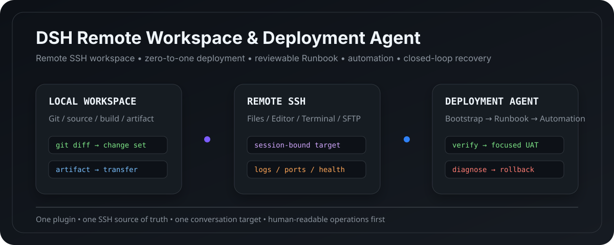
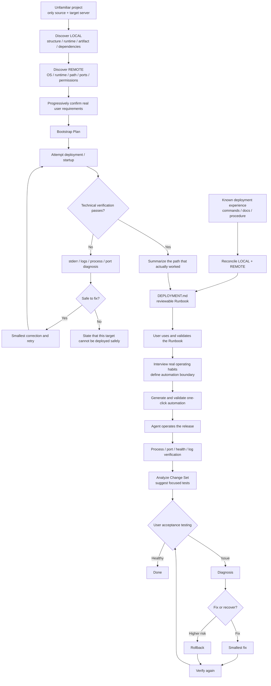

<div align="center">

# DSH Remote Workspace & Deployment Agent

### `dsh-ssh-files-sidebar`

**A complete Remote SSH workspace for DeepSeek Harness: files, terminal, remote editing, zero-to-one deployment, runbooks, automation, and closed-loop delivery.**

[](https://github.com/qigelunbiya/dsh-ssh-files-sidebar/actions/workflows/build.yml)
[](https://github.com/qigelunbiya/dsh-ssh-files-sidebar/releases/latest)
[](./LICENSE)
[](https://github.com/topics/dsh-plugin)

[简体中文](./README.md) · **English**



</div>

---

## Understand it in 30 seconds

Use this plugin when your DeepSeek Harness workflow involves:

- Linux / SSH servers;
- remote file browsing, editing, upload, and download;
- local source code with remote service startup, logs, and port checks;
- an unfamiliar project whose deployment procedure is not known yet;
- capturing a working procedure into `DEPLOYMENT.md`;
- graduating a validated Runbook into one-click automation and eventually agent-operated delivery, verification, diagnosis, and recovery.

The goal is to keep all of that inside **one conversation, one SSH safety boundary, and one deployment maturity path**.

### More than an SSH file sidebar

| Capability | `dsh-ssh-files-sidebar` |
| --- | --- |
| SSH Files / SFTP / Terminal | ✅ |
| Remote Workspace | ✅ |
| Local source + session-bound Linked SSH | ✅ |
| Remote Vision / system OCR | ✅ |
| Zero-to-one deployment of unfamiliar projects | ✅ |
| `DEPLOYMENT.md` Runbook | ✅ |
| Automation boundary based on real user habits | ✅ |
| One-click scripts | ✅, only after Runbook validation |
| Agent-operated deploy + health/log verification | ✅ |
| UAT-driven diagnosis / fix / rollback loop | ✅ |

> Core principle: **discover the real environment and workflow first, document it second, automate it only after validation, and let the Agent operate the loop only after that automation is proven.**

---

## One-minute install

### Recommended: prebuilt GitHub Release

With an installed `dsh` CLI:

```powershell
dsh plugin --profile web add https://github.com/qigelunbiya/dsh-ssh-files-sidebar/releases/latest/download/dsh-ssh-files-sidebar.tgz
```

From a DeepSeek Harness source checkout:

```powershell
pnpm dsh plugin --profile web add https://github.com/qigelunbiya/dsh-ssh-files-sidebar/releases/latest/download/dsh-ssh-files-sidebar.tgz
```

Then start or restart the Web profile:

```powershell
dsh web
```

or, from source:

```powershell
pnpm dsh web
```

The release tarball already contains `lib/`, so normal users do **not** need to clone the repository, install dependencies, build the package, or grant install-time build permission.

> DeepSeek Harness also supports direct GitHub source installs. With pnpm 10, however, a git dependency's `prepare` script must be explicitly allowlisted. That is why this project recommends the prebuilt release tarball for normal users.

### GitHub source install (development / debugging)

```powershell
dsh plugin --profile web add github:qigelunbiya/dsh-ssh-files-sidebar
```

This repository provides `prepare`, so a git install can build its runtime bundle. If pnpm 10 blocks the script, follow the DSH / pnpm message and add `dsh-ssh-files-sidebar: true` under the profile's `pnpm-workspace.yaml -> allowBuilds`, then retry.

---

## Product capabilities

### 1. Remote SSH Workspace

One top-level plugin composes:

- `dsh-better-sidebar`
- `@linxin666/dsh-ssh`
- `dsh-rw`
- this project's SSH Files / Linked SSH / Deployment Layer

Hosts and credentials have one source of truth:

```text
~/.dsh/dsh-ssh.json
```

One conversation binds one SSH target. The Agent does not get a free multi-host surface for host enumeration or switching.

### 2. SSH Files + Editor + Terminal

SSH Files includes:

- remote directory tree;
- CodeMirror edit / save;
- image, PDF, HTML, and archive preview;
- multi-select;
- upload / download;
- inline rename;
- directory creation / delete;
- per-session expansion memory.

Shortcuts:

| Action | Shortcut |
| --- | --- |
| Toggle selection | `Ctrl/Cmd + Click` |
| Range select | `Shift + Click` |
| Select visible items | `Ctrl/Cmd + A` |
| Inline rename | `F2` |
| Delete | `Delete` |
| Save | `Ctrl/Cmd + S` |
| Search / replace | `Ctrl/Cmd + F` |

### 3. Local Workspace + Linked SSH

Recommended development / deployment model:

```text
LOCAL Workspace (real source)
        +
Conversation Linked SSH (single target)
        +
Project-root DEPLOYMENT.md
```

Git, builds, and artifact checks stay local. Uploads, service management, logs, and health checks stay locked to the current conversation's server.

### 4. Remote Vision / OCR

The Agent can inspect images directly from the current SSH target. Text-only flows can use supported system OCR paths without manually copying a server screenshot into the local Workspace first.

---

## From "I don't know how to deploy this" to a closed loop

Two entry paths converge on the same mature workflow.



### Zero-to-One Bootstrap: prove it before documenting it

For a project with no trustworthy deployment history, the Agent does not invent a polished `DEPLOYMENT.md` first.

It:

1. inspects the local project for stack, runtime, entry point, artifacts, configuration, external services, ports, and persistence;
2. infers the runtime payload instead of blindly copying the whole repository;
3. inspects the bound server for OS, architecture, runtimes, writable paths, occupied ports, service managers, permissions, and disk space;
4. discovers facts itself and asks the user only for unresolved preferences or business decisions;
5. works through a provisional **Bootstrap Plan**;
6. diagnoses failures from stderr, logs, process state, and ports, then applies the smallest evidence-backed correction;
7. explicitly states when the target cannot safely run the project instead of escalating server-wide changes just to avoid failure;
8. captures the **actual successful path** into `DEPLOYMENT.md` only after the first deployment is technically stable.

See [Project Deployment Runbook](./docs/deployment-runbook.md) for the full model.

---

## Runbook → automation, not a black box first

`DEPLOYMENT.md` is the complete human-readable operational knowledge base. A documented command does **not** imply that the user wants it automated.

Before generating a script, the Agent maps each step to:

```text
AUTOMATE             → include in the script
KEEP MANUAL          → keep as an operator step
EXTERNAL / HAND-OFF  → handled by another tool / process
NOT IN NORMAL RUN    → keep in the Runbook, omit from the normal one-click path
```

A final script may automate only 30% of the Runbook if that is what matches the operator's real workflow.

---

## Closed-loop delivery

Once the Runbook, automation boundary, and script have all been validated in real use, the Agent moves from command generator to release operator:

```text
Resolve this release
      ↓
Run validated automation
      ↓
Independently verify process / port / health / logs
      ↓
Summarize evidence-backed changed areas
      ↓
Tell the user what business behavior to test
      ↓
User acceptance
  ↙         ↘
healthy      issue
  ↓            ↓
done      diagnose / fix / rollback
               ↓
            verify again
```

A zero exit code is not deployment success; a successful rollback command is not recovery. Both require independent verification.

---

## Architecture

```text
One top-level install: dsh-ssh-files-sidebar
│
├─ dsh-better-sidebar
│  └─ workbench / Files / Editor / Terminal / Browser
│
├─ @linxin666/dsh-ssh
│  └─ SSH Host / Web Terminal / SFTP / Tunnel / Engine
│
├─ dsh-rw
│  └─ Local / Remote Workspace + Read/Write/Edit/Glob/Grep/Bash shim
│
├─ SSH Files + Linked SSH
│  ├─ remote tree / editor / preview / transfer
│  ├─ session-bound SSH tools
│  ├─ remote vision
│  └─ OCR fallback
│
└─ Deployment Layer
   ├─ zero-to-one Bootstrap discovery
   ├─ Bootstrap Plan
   ├─ DEPLOYMENT.md Runbook
   ├─ automation coverage interview
   ├─ one-click automation
   └─ autonomous deploy → verify → UAT → diagnose / rollback
```

---

## Safety boundaries

- one conversation operates one SSH target;
- Remote Workspace takes precedence, otherwise Linked SSH is used;
- `DEPLOYMENT.md` `target-ssh` must match the current session lock;
- high-risk actions still use Harness-native approvals;
- database restore/migration, recursive deletion, system packages, firewall, disk, and host reboot do not become implicitly authorized by a Runbook;
- unfamiliar-project Bootstrap does not silently change global runtimes, firewall, reverse proxy, databases, or unrelated services just to make a deployment succeed;
- production incidents do not silently auto-rollback unless the user has explicitly approved that policy and its triggers.

---

## Developer install

```powershell
git clone https://github.com/qigelunbiya/dsh-ssh-files-sidebar.git
cd dsh-ssh-files-sidebar
pnpm install
pnpm build
```

From a Harness source checkout:

```powershell
pnpm dsh plugin --profile web add link:E:/path/to/dsh-ssh-files-sidebar
pnpm dsh web
```

Only one top-level `dsh-ssh-files-sidebar` loader row is required. Do not mount standalone `dsh-better-sidebar`, `@linxin666/dsh-ssh`, or `dsh-rw` rows beside it.

---

## Updating

Release users can reinstall the newest prebuilt package:

```powershell
dsh plugin --profile web remove dsh-ssh-files-sidebar
dsh plugin --profile web add https://github.com/qigelunbiya/dsh-ssh-files-sidebar/releases/latest/download/dsh-ssh-files-sidebar.tgz
```

Source developers:

```powershell
git pull
pnpm install
pnpm build
```

---

## Documentation

- [Deployment Runbook: zero-to-one → Runbook → automation → closed loop](./docs/deployment-runbook.md)
- [Deployment Agent design draft (Chinese)](./docs/deployment-agent-design.zh.md)
- [Distribution / discoverability checklist](./docs/distribution.md)

## Upstream projects and acknowledgements

- [`dsh-better-sidebar`](https://github.com/omdsh-dev/DSH-better-sidebar) — MIT
- [`@linxin666/dsh-ssh`](https://github.com/DamonKoy/dsh-web-ui) — Apache-2.0
- [`dsh-rw`](https://github.com/MDR-EX1000/dsh-rw) — MIT

See [NOTICE](./NOTICE) for attribution details.

## License

[MIT](./LICENSE)
