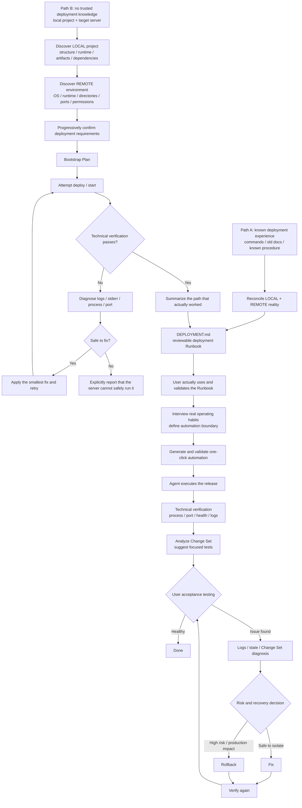

<div align="center">

# dsh-ssh-files-sidebar

**An integrated Remote SSH workspace and closed-loop deployment agent for DeepSeek Harness**

One plugin for the right-side workbench, SSH hosts and terminal, Remote Workspace, SSH Files, remote vision/OCR, zero-to-one deployment bootstrap, deployment runbooks, automation scripts, and agent-operated delivery.

[](https://github.com/qigelunbiya/dsh-ssh-files-sidebar/actions/workflows/build.yml)
[](./package.json)
[](./LICENSE)

[简体中文](./README.md) · **English**

</div>

---

## What this project is

`dsh-ssh-files-sidebar` is more than a file sidebar and more than a thin SSH command wrapper. It brings the remote-development, server-operations, and deployment pieces around DeepSeek Harness into one workflow:

- **One top-level plugin**: internally composes `dsh-better-sidebar`, `@linxin666/dsh-ssh`, and `dsh-rw`.
- **One SSH configuration**: hosts and credentials are shared through `~/.dsh/dsh-ssh.json`.
- **Local + remote execution planes**: source code, builds, and artifacts stay in the LOCAL Workspace; server operations stay locked to the single SSH target of the current conversation.
- **VS Code-like SSH Files**: browse, edit, preview, upload, download, rename, delete, and multi-select remote files.
- **Agent-readable remote content**: direct remote image inspection plus a local OCR path on supported Windows/macOS environments.
- **Zero-to-one deployment bootstrap**: inspect an unfamiliar local project and the target server, progressively confirm requirements, attempt the deployment, diagnose logs, and capture a Runbook only after a real working path exists.
- **Deployment maturity from knowledge to a closed loop**: Runbook → user validation → workflow-habit interview → optional one-click automation → agent-operated deploy, verification, acceptance, diagnosis, and recovery.

> Core principle: **understand the real environment first, document what is actually proven, validate before automating, then let the Agent operate the mature workflow.**

## Two deployment entry paths, one mature closed loop

Since 0.8.5, deployment explicitly supports two very different starting points.



The distinction matters:

- **Known procedure**: inspect and reconcile it, then document it.
- **Unknown procedure**: make the first deployment genuinely work, then document the proven result.

The project does not require an unfamiliar application to begin with a polished-looking `DEPLOYMENT.md` that has never actually been tested.

See [Deployment Runbook](./docs/deployment-runbook.md) for the full behavior model.

## Zero-to-one bootstrap for an unfamiliar project

When the user only has a local project and asks the Agent to deploy it to the currently linked server, but there is no trustworthy deployment procedure yet, the Agent enters the Bootstrap path.

### 1. Discover the local project first

The Agent should inspect the real LOCAL Workspace and determine, where possible:

- project type, language, and main stack;
- dependency manager, build entry point, and runtime entry point;
- runtime and version requirements;
- build outputs / deployment artifacts;
- runtime code, static assets, templates, and configuration;
- environment variables and external services such as databases, Redis, or MQ;
- native / OS / CPU architecture requirements;
- migrations, persistent directories, ports, and health endpoints.

The goal is not to blindly copy the whole repository. The Agent should distinguish:

```text
BUILD ONLY           development / build-time material
RUNTIME PAYLOAD      what the server actually needs
EXTERNAL / MANAGED   maintained separately by the server or another system
PERSISTENT           must survive releases
UNKNOWN              not safe to exclude yet
```

### 2. Discover the target server

Only the current conversation-bound SSH target is inspected. Relevant facts include:

- OS / CPU architecture;
- installed runtimes and versions;
- Docker / systemd / PM2 / Supervisor or other process models;
- current user, permissions, and writable directories;
- disk space;
- existing services and occupied ports;
- existing application directories;
- log locations;
- unrelated workloads that must not be overwritten or stopped.

User-specified directories, ports, environments, or service models are treated as requirements to validate. If the user has not specified them, the Agent proposes a small number of reasonable options from the actual server rather than silently choosing an arbitrary path.

### 3. Confirm progressively instead of asking a giant questionnaire

Bootstrap should alternate inspection with short decisions:

```text
Agent inspects what it can
    ↓
A real user decision appears
    ↓
Ask only that decision
    ↓
User confirms or adjusts it
    ↓
Continue discovery / execution
```

Facts that can be discovered from the project or server should not be pushed back to the user as questions. User input is reserved for preferences, business constraints, and risk decisions.

### 4. Keep a provisional Bootstrap Plan

Before the first deployment is proven, the plan is intentionally provisional:

```text
LOCAL      current local preparation
TRANSFER   what will be transferred
REMOTE     current release / startup approach
VERIFY     success criteria for this attempt
RECOVERY   how to back out or stop impact from growing
```

Before meaningful mutations, the Agent should show the current plan, the next command or transfer, the expected result, and the impact. Material changes to destination, runtime strategy, service model, or other major assumptions require renewed confirmation.

### 5. Attempt, inspect logs, and debug from evidence

A failed first start is not the end of the workflow. The Agent should diagnose from concrete evidence:

```text
execute
 ↓
exit code / stderr / logs
 ↓
process / service / port / health
 ↓
identify the most likely cause
 ↓
propose the smallest corrective change
 ↓
confirm when necessary
 ↓
retry
```

The Agent should not randomly cycle through commands merely to make the application appear to start, and should not make broad server changes without evidence.

### 6. Explicitly admit when the server cannot safely run the project

If deployment is blocked by constraints that cannot safely be resolved inside the approved scope—for example incompatible OS/CPU/runtime, missing required infrastructure or secrets, insufficient privileges, impossible network/port constraints, unsupported native dependencies, inadequate resources, or changes that would require invasive production modifications—the Agent should stop and say so clearly.

It should report the blocker, the evidence, what has already been proven, and realistic next options. It must not hide fatal logs or claim success to avoid admitting that the target is currently not viable.

### 7. Only capture DEPLOYMENT.md after the first real success

A first technical baseline exists only when the process/service remains up, required ports or health checks pass where applicable, and recent logs do not show blocking startup failures.

The Agent then summarizes the **actual path that worked** and asks the user whether that result should become the deployment baseline. The resulting `DEPLOYMENT.md` should record:

- the runtime/version actually used;
- the real transfer payload;
- the remote location;
- configuration and persistence assumptions;
- start / stop / restart behavior;
- verification;
- recovery / rollback;
- useful known issues.

Failed dead-end experiments should not become normal deployment steps.

## From Runbook to automation: not every command belongs in a script

`DEPLOYMENT.md` is the complete operational knowledge base, but **a documented command does not imply that the user wants it automated**.

| Stage | Goal |
| --- | --- |
| 0. Bootstrap (optional) | When no trusted procedure exists, discover and make the first deployment work |
| 1. Runbook | Capture proven deployment knowledge in a readable, reviewable `DEPLOYMENT.md` |
| 2. User validation | The operator uses it, adjusts it, and explicitly considers it stable |
| 3. Habit interview | Decide which steps are automated, manual, external hand-offs, or outside the normal run |
| 4. One-click automation | Automate only the subset the user actually wants automated |
| 5. Agent closed loop | Execute, verify, hand off, diagnose, and recover |

Before scripting, the Agent builds an automation coverage map:

```text
AUTOMATE             → include in the script
KEEP MANUAL          → keep as an operator action
EXTERNAL / HAND-OFF  → handled by another tool or process
NOT IN NORMAL RUN    → retained in the Runbook, omitted from the normal one-click path
```

The goal is not maximum automation. The goal is **automation that matches how the operator really works**.

## Mature closed-loop delivery

Once the Runbook, automation boundary, and script entry point have been validated in real use, the Agent moves from “command generator” to “release operator.”

A mature deployment should, where possible:

1. resolve the exact release artifact/version and environment;
2. execute inside the approved LOCAL / REMOTE boundary;
3. independently verify process, port, health, and logs instead of trusting the script exit code;
4. summarize the real change set when reliable Git/Workspace evidence exists;
5. recommend focused user tests based on those changes;
6. close the release when user acceptance is healthy;
7. enter logs/state/change-set diagnosis when the user reports an issue;
8. prioritize recovery as risk grows and let the user choose further diagnosis, rollback commands, or Agent-executed rollback;
9. verify again after a fix or rollback before declaring recovery.

## Core capabilities

| Capability | What it does |
| --- | --- |
| Better Sidebar | Internally integrates the right-side workbench and Files / Editor / Terminal / Browser surfaces |
| SSH Host & Terminal | Reuses `@linxin666/dsh-ssh` host management, Web Terminal, SFTP, and tunnels |
| Remote Workspace | Reuses `dsh-rw` so Read / Write / Edit / Glob / Grep / Bash can transparently operate a remote Workspace |
| Linked SSH | Lets a local source Workspace bind one session-scoped SSH target for local development + remote deployment |
| SSH Files | Remote tree, editor, preview, multi-select, upload/download, inline rename, directory creation, and delete |
| Vision / OCR | Reads remote images directly for visual analysis; text-only flows can use system OCR where supported |
| Zero-to-One Bootstrap | Discovers an unfamiliar LOCAL project and REMOTE target, confirms requirements, attempts and diagnoses deployment, then captures the working baseline |
| Deployment Runbook | One project-owned `DEPLOYMENT.md` covering LOCAL / TRANSFER / REMOTE / VERIFY / ROLLBACK |
| Automation Maturity | Validates the Runbook, interviews user habits, defines coverage, then creates automation |
| Closed-loop Delivery | Agent executes validated automation, verifies the service, recommends tests, accepts feedback, diagnoses, and rolls back when appropriate |
| Session Safety | One SSH target per conversation; high-risk actions still use Harness-native approvals |

## Architecture

```text
One top-level install: dsh-ssh-files-sidebar
│
├─ dsh-better-sidebar (integrated)
│  ├─ right-side workbench
│  ├─ Files / Editor / Terminal / Browser
│  └─ /sidebar/* host routes + client shell
│
├─ @linxin666/dsh-ssh (integrated)
│  ├─ ~/.dsh/dsh-ssh.json   ← single SSH source of truth
│  ├─ Host UI / Web Terminal / SFTP / Tunnel
│  └─ SSH engine / APIs
│
├─ dsh-rw (integrated)
│  ├─ Local / Remote SSH Workspace
│  └─ Read / Write / Edit / Glob / Grep / Bash remote shim
│
├─ SSH Files
│  ├─ remote file tree + CodeMirror
│  ├─ image / PDF / HTML / archive preview
│  ├─ multi-select / upload / download / rename / delete
│  └─ per-session expansion memory
│
├─ Linked SSH Agent Tools
│  ├─ session-bound SSH operations
│  ├─ remote vision
│  └─ OCR fallback
│
└─ Deployment Layer
   ├─ zero-to-one bootstrap discovery
   ├─ provisional Bootstrap Plan
   ├─ DEPLOYMENT.md Runbook
   ├─ command transparency / approvals
   ├─ automation coverage interview
   └─ autonomous deploy → verify → UAT → diagnose / rollback
```

## Recommended usage

### 1. Local source Workspace + Linked SSH

Recommended for development and deployment:

```text
LOCAL Workspace (real source tree)
        +
Conversation Linked SSH (single target server)
        +
Project deployment knowledge (Bootstrap Plan or DEPLOYMENT.md)
```

Local build, Git, and artifact inspection stay local. Uploads, service management, logs, and health checks are restricted to the SSH target bound to the current conversation.

### 2. Remote SSH Workspace

Use this when you want to browse, edit, search, or run commands directly inside a remote project directory. `dsh-rw` transparently forwards model-facing file tools to the remote Workspace while the remote server remains the source of truth.

> Project-level `DEPLOYMENT.md` still belongs to the real local source Workspace, not the local placeholder directory used for a Remote Workspace.

## Installation

### Requirements

- DeepSeek Harness Web environment
- Node.js `>= 22.19.0`
- `pnpm`
- An accessible SSH host for remote features

### First install

```powershell
git clone https://github.com/qigelunbiya/dsh-ssh-files-sidebar.git
cd dsh-ssh-files-sidebar
pnpm install
pnpm build
```

Then, from the DeepSeek Harness source directory:

```powershell
pnpm dsh plugin --profile web add link:E:/path/to/dsh-ssh-files-sidebar
pnpm dsh web
```

> Current versions need only one top-level `dsh-ssh-files-sidebar` loader row. `dsh-better-sidebar`, `@linxin666/dsh-ssh`, and `dsh-rw` are composed internally.

## Upgrading from older versions

```powershell
cd E:\path\to\dsh-ssh-files-sidebar
git pull
pnpm install
pnpm build
```

If the profile still contains old standalone integration rows, remove them to avoid duplicated routes, UI, or shims:

```powershell
cd E:\path\to\deepseek-harness

pnpm dsh plugin --profile web remove dsh-better-sidebar
pnpm dsh plugin --profile web remove @linxin666/dsh-ssh
pnpm dsh plugin --profile web remove dsh-rw
pnpm dsh plugin --profile web add link:E:/path/to/dsh-ssh-files-sidebar
pnpm dsh web
```

Missing entries can be ignored. After upgrading, a browser hard refresh (`Ctrl + Shift + R`) is recommended.

## SSH configuration and safety boundaries

The only SSH configuration source is:

```text
~/.dsh/dsh-ssh.json
```

Safety boundaries:

- one conversation can operate only one SSH target;
- Remote Workspace metadata takes precedence, otherwise the header Linked SSH binding is used;
- the Agent does not receive a generic multi-host SSH surface for free host enumeration/switching;
- `DEPLOYMENT.md` `target-ssh` must match the current session lock;
- Bootstrap must not overwrite or stop unrelated applications merely to find a convenient deployment location;
- database restore, recursive deletion, system packages/firewall/disk/host reboot, and similar high-risk operations continue to use Harness-native approvals;
- production incidents do not silently auto-rollback unless the Runbook/automation policy explicitly defines and the user has approved that behavior;
- if the current server cannot safely run the project within the approved scope, the Agent should stop and report the blocker rather than expanding the blast radius.

## SSH Files

### Shortcuts

| Action | Shortcut |
| --- | --- |
| Toggle item selection | `Ctrl/Cmd + Click` |
| Range selection | `Shift + Click` |
| Select visible items | `Ctrl/Cmd + A` |
| Inline rename | `F2` |
| Delete selection | `Delete` |
| Save editor | `Ctrl/Cmd + S` |
| Search / replace | `Ctrl/Cmd + F` |

### Preview and editing

- Text: CodeMirror with common language highlighting, line numbers, search/replace, folding, and remote save.
- HTML: source / sandbox preview switching.
- Images: PNG / JPG / JPEG / GIF / WebP / BMP / ICO / AVIF.
- PDF: embedded browser preview.
- Archives: TAR / TGZ / TAR.GZ / TAR.BZ2 / TAR.XZ / ZIP / GZ / BZ2 / XZ / 7Z / RAR; exact support depends on commands available on the remote host.

Automatic text preview defaults to 8 MB; image/PDF preview defaults to 64 MB. Larger files can still be downloaded.

## Deployment Runbook

Each real local source project can own a:

```text
DEPLOYMENT.md
```

Recommended structure:

```text
LOCAL      local checks / build / artifacts
TRANSFER   local → current SSH target
REMOTE     release / service management
VERIFY     process / port / health / logs
ROLLBACK   restore a stable state
```

Runbooks may use variables, pipes, `&&`, conditions, loops, command substitution, and multi-line PowerShell/Bash blocks. The requirement is that the **real operational logic remains visible and reviewable**.

If the project has no trusted deployment procedure yet, do not fabricate a “stable Runbook” first. Bootstrap the deployment, prove a real working path, then capture it.

More details:

- [Project Deployment Runbook](./docs/deployment-runbook.md)
- [Deployment Agent design draft (Chinese)](./docs/deployment-agent-design.zh.md)

## Upstream projects and acknowledgements

This plugin composes the following projects into one top-level installation:

- [`dsh-better-sidebar`](https://github.com/omdsh-dev/DSH-better-sidebar) — MIT
- [`@linxin666/dsh-ssh`](https://github.com/DamonKoy/dsh-web-ui) — Apache-2.0
- [`dsh-rw`](https://github.com/MDR-EX1000/dsh-rw) — MIT

See [NOTICE](./NOTICE) for attribution details.

## License

[MIT](./LICENSE)
