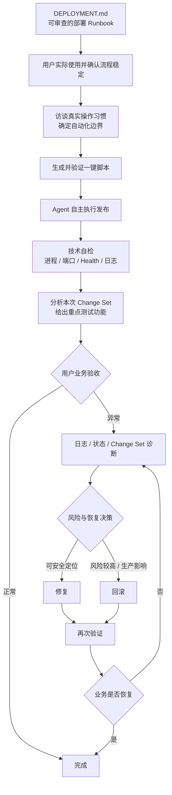

<div align="center">

# dsh-ssh-files-sidebar

**DeepSeek Harness 的一体化 Remote SSH 工作区与闭环部署 Agent**

把右侧工作台、SSH 主机与终端、远程 Workspace、SSH Files、远程图像/OCR、部署 Runbook、自动化脚本和发布闭环整合进一个插件。

[](https://github.com/qigelunbiya/dsh-ssh-files-sidebar/actions/workflows/build.yml)
[](./package.json)
[](./LICENSE)

**简体中文** · [English](./README.en.md)

</div>

---

## 项目定位

`dsh-ssh-files-sidebar` 不是单纯的文件侧栏，也不是只会执行几条 SSH 命令的工具。它把 DeepSeek Harness 中和远程开发、服务器运维、项目发布相关的能力收敛到同一条工作流里：

- **一个顶层插件**：内部集成 `dsh-better-sidebar`、`@linxin666/dsh-ssh` 和 `dsh-rw`。
- **一份 SSH 配置**：主机与凭据统一使用 `~/.dsh/dsh-ssh.json`。
- **本地 + 远程双执行平面**：源码、构建与本地产物留在 LOCAL Workspace；服务器操作锁定到当前会话唯一 SSH。
- **VS Code 风格 SSH Files**：远程浏览、编辑、预览、上传、下载、重命名、删除与多选。
- **Agent 可直接理解远程内容**：支持远程图片视觉分析，以及 Windows/macOS 上的本地 OCR 路径。
- **部署从“文档”逐步成熟到“闭环”**：先 Runbook，再自动化，再由 Agent 自主发布、自检、交接、诊断和恢复。

> 核心原则：**先把真实流程做透明、做稳定，再逐步提高自动化程度。**

## 部署闭环

下面这张图是项目当前部署能力的核心设计：



这意味着成熟后的正常发布不再是“Agent 给你一串命令，然后你自己去执行”，而是：

1. Agent 确认本次发布输入和环境状态；
2. 在已确认的自动化边界内自己执行；
3. 独立检查服务状态，而不是只相信脚本退出码；
4. 如果能从 Git / Workspace 可靠获取变更，说明本次主要修改区域；
5. 基于真实变更告诉用户重点测试哪些业务功能；
6. 用户验收正常则结束；
7. 用户反馈异常则进入诊断；
8. 风险较高时优先给出恢复方案，并让用户决定继续排查、查看回滚命令或由 Agent 执行回滚；
9. 修复或回滚后再次验证，直到闭环。

完整规则见 [部署 Runbook 文档](./docs/deployment-runbook.md)。

## 自动化成熟度：不是所有命令都应该进脚本

`DEPLOYMENT.md` 是完整的部署知识库，但 **Runbook 中存在一条命令，不代表用户希望脚本执行它**。

项目把部署自动化分成四个前置阶段和一个闭环阶段：

| 阶段 | 目标 |
| --- | --- |
| 1. Runbook | 用可读、可审查的 `DEPLOYMENT.md` 整理真实流程 |
| 2. 用户验证 | 用户实际使用、调整，并明确确认流程已经稳定 |
| 3. 使用习惯访谈 | 确定哪些步骤自动、手动、外部交接或不属于日常流程 |
| 4. 一键脚本 | 只自动化用户明确需要自动执行的部分 |
| 5. Agent 闭环 | Agent 自主执行、自检、交接、诊断与恢复 |

在生成脚本前，Agent 会先形成自动化覆盖表：

```text
AUTOMATE             → 纳入脚本
KEEP MANUAL          → 保留人工操作
EXTERNAL / HAND-OFF  → 由其他工具或流程处理
NOT IN NORMAL RUN    → Runbook 保留，但不进入日常一键流程
```

因此，项目追求的不是“自动化率越高越好”，而是**自动化边界和用户真实习惯一致**。

## 核心能力

| 能力 | 说明 |
| --- | --- |
| Better Sidebar | 内部集成右侧工作台、Files / Editor / Terminal / Browser 等能力 |
| SSH Host & Terminal | 复用 `@linxin666/dsh-ssh` 的主机管理、Web Terminal、SFTP、Tunnel |
| Remote Workspace | 复用 `dsh-rw`，让 Read / Write / Edit / Glob / Grep / Bash 能透明操作远程 Workspace |
| Linked SSH | 本地源码 Workspace 可以绑定一个会话级 SSH，适合本地开发 + 远程发布 |
| SSH Files | 远程文件树、编辑、预览、多选、上传下载、原地重命名、新建目录和删除 |
| Vision / OCR | 直接读取远程图片做视觉分析；文本模型可走系统 OCR 回退路径 |
| Deployment Runbook | 每个本地项目维护自己的 `DEPLOYMENT.md`，记录 LOCAL / TRANSFER / REMOTE / VERIFY / ROLLBACK |
| Automation Maturity | Runbook 验证后再访谈用户习惯、确定自动化边界、生成脚本 |
| Closed-loop Delivery | Agent 自主执行已验证流程、技术自检、给出测试重点、接收用户验收、诊断或回滚 |
| Session Safety | 一个 Conversation 只允许一个 SSH 目标，高风险操作继续走 Harness 原生审批 |

## 架构

```text
一个顶层安装：dsh-ssh-files-sidebar
│
├─ dsh-better-sidebar（内部集成）
│  ├─ 右侧工作台
│  ├─ Files / Editor / Terminal / Browser
│  └─ /sidebar/* host routes + client shell
│
├─ @linxin666/dsh-ssh（内部集成）
│  ├─ ~/.dsh/dsh-ssh.json   ← 唯一 SSH 配置源
│  ├─ Host UI / Web Terminal / SFTP / Tunnel
│  └─ SSH engine / APIs
│
├─ dsh-rw（内部集成）
│  ├─ 本机 / 远程 SSH Workspace
│  └─ Read / Write / Edit / Glob / Grep / Bash remote shim
│
├─ SSH Files
│  ├─ 远程文件树 + CodeMirror
│  ├─ 图片 / PDF / HTML / 压缩包预览
│  ├─ 多选 / 上传 / 下载 / 重命名 / 删除
│  └─ 会话级目录展开记忆
│
├─ Linked SSH Agent Tools
│  ├─ session-bound SSH operations
│  ├─ remote vision
│  └─ OCR fallback
│
└─ Deployment Layer
   ├─ DEPLOYMENT.md Runbook
   ├─ command transparency / approvals
   ├─ automation coverage interview
   └─ autonomous deploy → verify → UAT → diagnose / rollback
```

## 推荐使用方式

项目主要支持两种工作模式。

### 1. 本地源码 Workspace + Linked SSH

推荐用于日常开发和部署：

```text
LOCAL Workspace（真实源码）
        +
Conversation Linked SSH（唯一目标服务器）
        +
项目根目录 DEPLOYMENT.md
```

本地构建、Git、产物检查留在本机；上传、服务管理、日志和 Health Check 只作用于当前会话绑定服务器。

### 2. Remote SSH Workspace

适合直接在服务器目录中浏览、编辑、搜索或运行命令。`dsh-rw` 会把模型原生文件工具透明转发到对应远程 Workspace，远程文件仍以服务器为 source of truth，不做本地镜像。

## 安装

### 环境要求

- DeepSeek Harness Web 环境
- Node.js `>= 22.19.0`
- `pnpm`
- 可访问的 SSH 主机（如需远程能力）

### 首次安装

```powershell
git clone https://github.com/qigelunbiya/dsh-ssh-files-sidebar.git
cd dsh-ssh-files-sidebar
pnpm install
pnpm build
```

然后在 DeepSeek Harness 源码目录中：

```powershell
pnpm dsh plugin --profile web add link:E:/你的路径/dsh-ssh-files-sidebar
pnpm dsh web
```

> 当前版本只需要一个顶层 `dsh-ssh-files-sidebar` loader row。`dsh-better-sidebar`、`@linxin666/dsh-ssh` 和 `dsh-rw` 已由本项目内部组合。

## 从旧版本升级

更新插件：

```powershell
cd E:\你的路径\dsh-ssh-files-sidebar
git pull
pnpm install
pnpm build
```

如果 Profile 里仍然单独存在旧的集成项，建议移除，避免重复路由、重复 UI 或重复 Shim：

```powershell
cd E:\你的路径\deepseek-harness

pnpm dsh plugin --profile web remove dsh-better-sidebar
pnpm dsh plugin --profile web remove @linxin666/dsh-ssh
pnpm dsh plugin --profile web remove dsh-rw
pnpm dsh plugin --profile web add link:E:/你的路径/dsh-ssh-files-sidebar
pnpm dsh web
```

未安装的条目如果提示不存在可以忽略。升级后建议浏览器执行一次 `Ctrl + Shift + R` 硬刷新。

## SSH 配置

唯一 SSH 配置源：

```text
~/.dsh/dsh-ssh.json
```

不需要再为 Remote Workspace 维护第二份 SSH 密码或主机表。

安全边界：

- 一个 Conversation 只操作一个 SSH 目标；
- Remote Workspace 优先决定目标，否则使用会话顶部 Linked SSH；
- Agent 不暴露自由枚举/切换多主机的通用 SSH 面；
- `DEPLOYMENT.md` 的 `target-ssh` 必须与当前 session lock 一致；
- 数据库恢复、递归删除、系统包/防火墙/磁盘/主机重启等高风险操作继续触发 Harness 原生审批；
- 除非已经在 Runbook / 自动化策略中明确配置并获得用户认可，否则生产异常不会静默自动回滚。

## SSH Files

### 常用快捷键

| 操作 | 快捷键 |
| --- | --- |
| 多选增减 | `Ctrl/Cmd + 点击` |
| 范围选择 | `Shift + 点击` |
| 选择当前可见项 | `Ctrl/Cmd + A` |
| 原地重命名 | `F2` |
| 删除选择 | `Delete` |
| 保存编辑 | `Ctrl/Cmd + S` |
| 搜索 / 替换 | `Ctrl/Cmd + F` |

### 预览与编辑

- 文本：CodeMirror，支持常见语言高亮、行号、搜索替换、折叠与远程保存。
- HTML：源码 / sandbox 预览切换。
- 图片：PNG / JPG / JPEG / GIF / WebP / BMP / ICO / AVIF。
- PDF：浏览器内嵌预览。
- 压缩包：TAR / TGZ / TAR.GZ / TAR.BZ2 / TAR.XZ / ZIP / GZ / BZ2 / XZ / 7Z / RAR；具体格式依赖远程服务器已有命令。

默认自动文本预览上限为 8 MB，图片/PDF 自动预览上限为 64 MB；超限文件仍可下载。

## Deployment Runbook

每个真实本地源码项目可以维护自己的：

```text
DEPLOYMENT.md
```

建议结构：

```text
LOCAL      本地检查 / 构建 / 产物
TRANSFER   本地 → 当前 SSH
REMOTE     发布 / 服务管理
VERIFY     进程 / 端口 / Health / 日志
ROLLBACK   恢复到稳定状态
```

Runbook 允许变量、管道、`&&`、条件、循环、命令替换和多行 PowerShell/Bash；重点是**真实逻辑必须可见、可审查**。

更多细节：

- [Project Deployment Runbook](./docs/deployment-runbook.md)
- [部署 Agent 设计草案](./docs/deployment-agent-design.zh.md)

## 上游依赖与致谢

本项目在同一顶层插件中复用以下项目：

- [`dsh-better-sidebar`](https://github.com/omdsh-dev/DSH-better-sidebar) — MIT
- [`@linxin666/dsh-ssh`](https://github.com/DamonKoy/dsh-web-ui) — Apache-2.0
- [`dsh-rw`](https://github.com/MDR-EX1000/dsh-rw) — MIT

完整归属信息见 [NOTICE](./NOTICE)。

## License

[MIT](./LICENSE)
