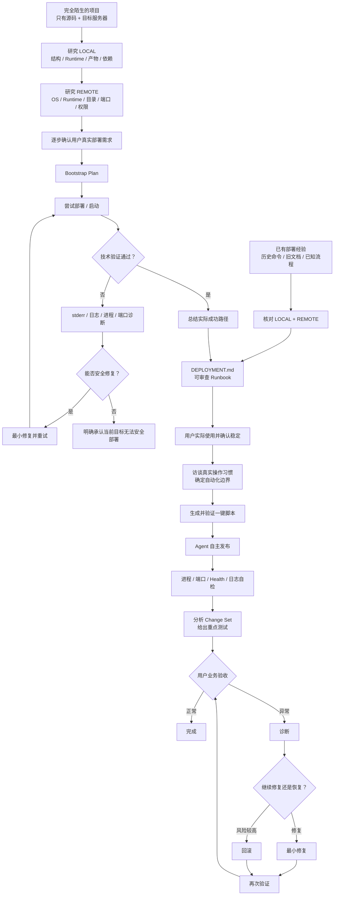

<div align="center">

# DSH Remote Workspace & Deployment Agent

### `dsh-ssh-files-sidebar`

**给 DeepSeek Harness 一套完整的 Remote SSH 工作区：文件、终端、远程编辑、从零部署、Runbook、自动化与发布闭环。**

[](https://github.com/qigelunbiya/dsh-ssh-files-sidebar/actions/workflows/build.yml)
[](https://github.com/qigelunbiya/dsh-ssh-files-sidebar/releases/latest)
[](./LICENSE)
[](https://github.com/topics/dsh-plugin)

**简体中文** · [English](./README.en.md)


</div>

---

## 30 秒看懂它

如果你在 DeepSeek Harness 里经常做这些事：

- 连接 Linux / SSH 服务器；
- 浏览、编辑、上传、下载远程文件；
- 在本地 Workspace 写代码，但去服务器启动、看日志、查端口；
- 接手一个完全陌生的项目，不知道它到底该怎么部署；
- 希望把已经跑通的部署流程沉淀成 `DEPLOYMENT.md`；
- 流程稳定后，再逐步变成一键脚本，最后让 Agent 自己发布、自检、诊断和回滚；

这个插件就是把这些环节放进**同一个 Conversation、同一个 SSH 安全边界、同一条部署成熟路径**里。

### 它和“只有 SSH 文件侧栏”最大的区别

| 能力 | `dsh-ssh-files-sidebar` |
| --- | --- |
| SSH Files / SFTP / Terminal | ✅ |
| Remote Workspace | ✅ |
| 本地源码 + 会话级 Linked SSH | ✅ |
| 远程图片 Vision / 系统 OCR | ✅ |
| 从零研究陌生项目并尝试部署 | ✅ |
| `DEPLOYMENT.md` Runbook | ✅ |
| 按用户真实习惯决定自动化边界 | ✅ |
| 一键脚本 | ✅，但只在 Runbook 验证后生成 |
| Agent 自主发布 + Health / 日志自检 | ✅ |
| 用户验收后的诊断 / 修复 / 回滚闭环 | ✅ |

> 核心原则：**先搞清楚真实环境和真实流程，再文档化；先验证，再自动化；自动化成熟后，再让 Agent 自主闭环。**

---

## 一分钟安装

### 推荐：预构建 GitHub Release，一条命令

如果你使用已经安装好的 `dsh` CLI：

```powershell
dsh plugin --profile web add https://github.com/qigelunbiya/dsh-ssh-files-sidebar/releases/latest/download/dsh-ssh-files-sidebar.tgz
```

如果你是在 DeepSeek Harness 源码目录里运行：

```powershell
pnpm dsh plugin --profile web add https://github.com/qigelunbiya/dsh-ssh-files-sidebar/releases/latest/download/dsh-ssh-files-sidebar.tgz
```

然后启动或重启 Web Profile：

```powershell
dsh web
```

源码运行则：

```powershell
pnpm dsh web
```

Release tarball 已包含构建后的 `lib/`，**用户不需要 clone、`pnpm install`、`pnpm build` 或允许依赖安装脚本**。

> DeepSeek Harness 官方也支持直接从 GitHub 安装源码包，但 pnpm 10 会要求用户显式允许 Git dependency 的 `prepare` 构建脚本。因此本项目把 **预构建 Release tarball** 作为普通用户的推荐安装方式。

### GitHub 源码安装（开发者 / 调试）

```powershell
dsh plugin --profile web add github:qigelunbiya/dsh-ssh-files-sidebar
```

本项目提供 `prepare`，Git 安装时可以自行构建 runtime bundle。若 pnpm 10 拒绝运行构建脚本，请按照 DSH / pnpm 输出，把 `dsh-ssh-files-sidebar: true` 加到对应 Profile 的 `pnpm-workspace.yaml -> allowBuilds` 后重试。

---

## 产品能力

### 1. Remote SSH Workspace

一个顶层插件内部整合：

- `dsh-better-sidebar`
- `@linxin666/dsh-ssh`
- `dsh-rw`
- 本项目自己的 SSH Files / Linked SSH / Deployment Layer

SSH 主机与凭据只维护一份：

```text
~/.dsh/dsh-ssh.json
```

一个 Conversation 只绑定一个 SSH 目标，Agent 不会为了完成任务自由枚举或切换到其他主机。

### 2. SSH Files + Editor + Terminal

SSH Files 支持：

- 远程目录树；
- CodeMirror 编辑 / 保存；
- PNG / JPG / GIF / WebP / BMP / ICO / AVIF；
- PDF；
- HTML 源码 / sandbox 预览；
- TAR / TGZ / ZIP / 7Z / RAR 等归档目录查看；
- 多选；
- 上传 / 下载；
- 原地重命名；
- 新建目录 / 删除；
- 会话级目录展开记忆。

快捷键：

| 操作 | 快捷键 |
| --- | --- |
| 多选增减 | `Ctrl/Cmd + 点击` |
| 范围选择 | `Shift + 点击` |
| 选择当前可见项 | `Ctrl/Cmd + A` |
| 原地重命名 | `F2` |
| 删除 | `Delete` |
| 保存 | `Ctrl/Cmd + S` |
| 搜索 / 替换 | `Ctrl/Cmd + F` |

### 3. 本地 Workspace + Linked SSH

推荐的日常开发 / 发布模式：

```text
LOCAL Workspace（真实源码）
        +
Conversation Linked SSH（唯一目标服务器）
        +
项目根目录 DEPLOYMENT.md
```

本地 Git、构建和产物检查留在本机；上传、服务管理、日志和 Health Check 固定在当前会话绑定服务器。

### 4. Remote Vision / OCR

Agent 可以直接读取当前 SSH 上的图片做视觉分析；文本模型或不希望走视觉模型时，可以使用支持平台上的系统 OCR 路径，不需要为了识别一张服务器截图先把它手工复制进本地 Workspace。

---

## 从“完全不会部署”到“Agent 自己闭环”

项目现在支持两条入口。



### Zero-to-One Bootstrap：先跑通，再写 Runbook

对于没有可靠历史部署方式的项目，Agent 不会先“猜”一份完整 `DEPLOYMENT.md`。

它会先：

1. 只读检查本地项目，识别技术栈、运行时、入口、产物、配置、外部依赖、端口、持久化等；
2. 判断真正需要上传的 runtime payload，而不是默认把整个仓库复制到服务器；
3. 只读检查当前绑定服务器的 OS、架构、Runtime、可写目录、端口、服务管理方式、权限和磁盘；
4. 能自己查到的事实自己查，只把真正的偏好 / 业务决策交给用户确认；
5. 通过临时 **Bootstrap Plan** 逐步执行、观察、修正；
6. 启动失败时根据 stderr、日志、进程和端口证据做最小修复，而不是随机试命令；
7. 如果目标服务器确实不满足条件，明确说明 blocker 和可选方案，不为了“必须跑起来”扩大修改范围；
8. 第一次真正稳定后，把**实际成功路径**总结成 `DEPLOYMENT.md`。

详细行为模型见 [Project Deployment Runbook](./docs/deployment-runbook.md)。

---

## Runbook → 自动化，而不是一开始就黑盒

`DEPLOYMENT.md` 是完整、可读的项目部署知识，但**文档里有一条命令，不代表用户希望脚本自动执行它**。

在脚本生成前，Agent 会和用户确认真实使用习惯，并把每个阶段标记为：

```text
AUTOMATE             → 纳入脚本
KEEP MANUAL          → 保留人工操作
EXTERNAL / HAND-OFF  → 由其他工具 / 流程完成
NOT IN NORMAL RUN    → Runbook 保留，但不进入日常一键路径
```

所以最终脚本可以只自动化 30% 的 Runbook，只要这 30% 才是用户真正希望交给机器做的部分。

---

## 发布后的闭环

当 Runbook、自动化边界和脚本都已经被用户实际验证后，Agent 的角色会从“给命令”升级为“执行这次发布”：

```text
确认本次发布内容
      ↓
Agent 执行已验证自动化
      ↓
独立检查进程 / 端口 / Health / 日志
      ↓
基于 Git / Workspace 证据总结主要修改
      ↓
告诉用户重点测试哪些业务功能
      ↓
用户验收
  ↙         ↘
正常         异常
 ↓            ↓
完成      诊断 / 修复 / 回滚
               ↓
             再验证
```

脚本退出码为 `0` 不等于部署成功；回滚命令返回成功也不等于已经恢复。两者都需要独立验证。

---

## 架构

```text
一个顶层安装：dsh-ssh-files-sidebar
│
├─ dsh-better-sidebar
│  └─ 右侧工作台 / Files / Editor / Terminal / Browser
│
├─ @linxin666/dsh-ssh
│  └─ SSH Host / Web Terminal / SFTP / Tunnel / Engine
│
├─ dsh-rw
│  └─ Local / Remote Workspace + Read/Write/Edit/Glob/Grep/Bash shim
│
├─ SSH Files + Linked SSH
│  ├─ remote tree / editor / preview / transfer
│  ├─ session-bound SSH tools
│  ├─ remote vision
│  └─ OCR fallback
│
└─ Deployment Layer
   ├─ zero-to-one Bootstrap discovery
   ├─ Bootstrap Plan
   ├─ DEPLOYMENT.md Runbook
   ├─ automation coverage interview
   ├─ one-click automation
   └─ autonomous deploy → verify → UAT → diagnose / rollback
```

---

## 安全边界

- 一个 Conversation 只操作一个 SSH 目标；
- Remote Workspace 优先决定目标，否则使用会话级 Linked SSH；
- `DEPLOYMENT.md` 的 `target-ssh` 必须匹配当前 session lock；
- 高风险动作仍走 Harness 原生审批；
- 数据库恢复 / 迁移、递归删除、系统包、Firewall、磁盘、主机重启等不会因为存在 Runbook 就自动获得授权；
- 陌生项目 Bootstrap 期间，不会为了“让它跑起来”默认修改全局 Runtime、Firewall、反向代理、数据库或其他已有服务；
- 除非用户已经明确批准自动回滚条件，否则生产异常不会静默自动回滚。

---

## 开发者安装

```powershell
git clone https://github.com/qigelunbiya/dsh-ssh-files-sidebar.git
cd dsh-ssh-files-sidebar
pnpm install
pnpm build
```

在 Harness 源码目录：

```powershell
pnpm dsh plugin --profile web add link:E:/你的路径/dsh-ssh-files-sidebar
pnpm dsh web
```

当前版本只需要一个顶层 `dsh-ssh-files-sidebar` loader row；不要再单独挂载 `dsh-better-sidebar`、`@linxin666/dsh-ssh` 或 `dsh-rw`。

---

## 更新

Release 安装用户建议安装最新预构建包：

```powershell
dsh plugin --profile web remove dsh-ssh-files-sidebar
dsh plugin --profile web add https://github.com/qigelunbiya/dsh-ssh-files-sidebar/releases/latest/download/dsh-ssh-files-sidebar.tgz
```

源码开发用户：

```powershell
git pull
pnpm install
pnpm build
```

---

## 文档

- [Deployment Runbook：从零部署 → Runbook → 自动化 → 闭环](./docs/deployment-runbook.md)
- [Deployment Agent 设计草案](./docs/deployment-agent-design.zh.md)
- [Distribution / 发布与曝光清单](./docs/distribution.md)

## 上游依赖与致谢

- [`dsh-better-sidebar`](https://github.com/omdsh-dev/DSH-better-sidebar) — MIT
- [`@linxin666/dsh-ssh`](https://github.com/DamonKoy/dsh-web-ui) — Apache-2.0
- [`dsh-rw`](https://github.com/MDR-EX1000/dsh-rw) — MIT

完整归属信息见 [NOTICE](./NOTICE)。

## License

[MIT](./LICENSE)
