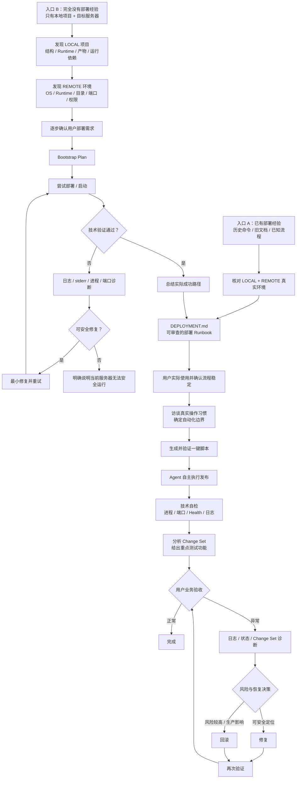

<div align="center">

# dsh-ssh-files-sidebar

**DeepSeek Harness 的一体化 Remote SSH 工作区与闭环部署 Agent**

把右侧工作台、SSH 主机与终端、远程 Workspace、SSH Files、远程图像/OCR、从零部署 Bootstrap、部署 Runbook、自动化脚本和发布闭环整合进一个插件。

[](https://github.com/qigelunbiya/dsh-ssh-files-sidebar/actions/workflows/build.yml)
[](./package.json)
[](./LICENSE)

**简体中文** · [English](./README.en.md)

</div>

---

## 项目定位

`dsh-ssh-files-sidebar` 不是单纯的文件侧栏，也不是只会执行几条 SSH 命令的工具。它把 DeepSeek Harness 中和远程开发、服务器运维、项目发布相关的能力收敛到同一条工作流里：

- **一个顶层插件**：内部集成 `dsh-better-sidebar`、`@linxin666/dsh-ssh` 和 `dsh-rw`。
- **一份 SSH 配置**：主机与凭据统一使用 `~/.dsh/dsh-ssh.json`。
- **本地 + 远程双执行平面**：源码、构建与本地产物留在 LOCAL Workspace；服务器操作锁定到当前会话唯一 SSH。
- **VS Code 风格 SSH Files**：远程浏览、编辑、预览、上传、下载、重命名、删除与多选。
- **Agent 可直接理解远程内容**：支持远程图片视觉分析，以及 Windows/macOS 上的本地 OCR 路径。
- **支持从零部署一个陌生项目**：先研究本地项目和服务器，再逐步确认需求、尝试部署、看日志、调试，真正跑通后才沉淀 `DEPLOYMENT.md`。
- **部署从“经验”逐步成熟到“闭环”**：Runbook → 用户验证 → 使用习惯访谈 → 可选一键脚本 → Agent 自主发布、自检、业务验收、诊断和恢复。

> 核心原则：**先搞清楚真实环境和真实流程，再文档化；先验证，再自动化；自动化成熟后，再让 Agent 自主完成闭环。**

## 两条部署入口，最终汇合到同一个闭环

0.8.5 开始，项目明确支持两种完全不同的起点。



这两条路径的区别非常重要：

- **已有经验**：先核对，再整理 Runbook。
- **没有经验**：先把第一次部署真正跑通，再把成功事实写成 Runbook。

项目不会要求一个完全陌生的项目在第一次尝试前就先生成一份“看起来很完整、其实没有验证过”的 `DEPLOYMENT.md`。

完整规则见 [部署 Runbook 文档](./docs/deployment-runbook.md)。

## 从零部署：Bootstrap 一个陌生项目

当用户只有一个本地项目，希望“帮我部署到这台服务器”，但没有可靠的部署命令时，Agent 会进入 Bootstrap 路径。

### 1. 先研究本地项目

Agent 应先在真实 LOCAL Workspace 中只读确认：

- 项目类型、语言和主要技术栈；
- 依赖管理器、构建入口和启动入口；
- Runtime 与版本要求；
- 构建输出 / 发布产物；
- 运行时真正需要的代码、静态资源、模板和配置；
- 环境变量、外部服务、数据库、Redis、MQ 等依赖；
- native / OS / CPU architecture 依赖；
- migration、持久化目录、端口和 Health Check。

重点不是“把整个仓库复制过去”，而是判断：

```text
BUILD ONLY           只在开发 / 构建阶段需要
RUNTIME PAYLOAD      服务器真正需要
EXTERNAL / MANAGED   应由服务器或其他系统单独维护
PERSISTENT           不能随版本覆盖
UNKNOWN              目前无法可靠判断，不能擅自删减
```

### 2. 再研究服务器

只检查当前 Conversation 已绑定的 SSH，确认：

- OS / CPU architecture；
- 已有 Runtime 及版本；
- Docker / systemd / PM2 / Supervisor 等运行方式；
- 当前用户、权限和可写目录；
- 磁盘空间；
- 已运行服务和已占用端口；
- 已有项目目录；
- 日志位置；
- 是否存在可能被误覆盖或误停止的其他应用。

如果用户已经指定目录、端口、运行方式或环境，就把它当成要求去验证；如果没有指定，Agent 根据真实服务器提出少量合理选项，而不是偷偷随便挑一个路径。

### 3. 渐进式确认，而不是一次性问卷

Bootstrap 不应该一上来让用户填写十几个问题。

推荐交互方式：

```text
Agent 自己检查
    ↓
发现真正需要用户做决定的分叉
    ↓
只问当前这个问题
    ↓
用户确认
    ↓
继续检查 / 继续推进
```

能从项目和服务器自己查到的事实，不重新丢给用户回答；只有部署偏好、业务约束和风险选择才需要用户确认。

### 4. 维护一个可变的 Bootstrap Plan

第一次部署阶段使用的是**临时、可变化的探索计划**，而不是稳定 Runbook：

```text
LOCAL      当前确认的本地准备动作
TRANSFER   准备传到服务器的内容
REMOTE     当前部署 / 启动方案
VERIFY     本轮成功条件
RECOVERY   本轮失败如何撤回或停止扩大影响
```

在第一次有实质性修改前，Agent 应展示当前计划、下一步命令或文件传输、预期结果和影响范围；当目录、Runtime 策略、服务方式或其他关键假设变化时重新确认。

### 5. 尝试部署、看日志、按证据调试

第一次部署失败并不等于流程结束。Agent 应基于真实证据进入调试循环：

```text
执行
 ↓
exit code / stderr / 日志
 ↓
进程 / service / 端口 / Health
 ↓
定位最可能原因
 ↓
提出最小修复
 ↓
必要时向用户确认
 ↓
重试
```

不应该为了“把程序跑起来”而随机试一堆命令，也不应该无依据地大范围修改服务器。

### 6. 服务器跑不了时必须明确承认

如果存在无法在当前授权范围内安全解决的阻塞，例如：

- OS / CPU / Runtime 明显不兼容；
- 必需基础设施不存在；
- 缺少必须由用户提供的 secret / credential；
- 权限不足；
- 端口 / 网络约束无法满足；
- native dependency 无法支持；
- 资源明显不足；
- 继续解决需要大范围修改生产服务器；

Agent 应停止扩大影响面，明确告诉用户：**当前目标服务器在已知条件下无法安全部署这个项目。**

同时说明阻塞证据、已经验证到哪里，以及现实可行的下一步，而不是隐藏致命错误或嘴硬宣称部署成功。

### 7. 第一次真正跑通后，再生成 DEPLOYMENT.md

只有当进程 / 服务能稳定运行、必要端口或 Health Check 正常、近期日志没有阻断性启动错误后，才算得到一个技术上可用的第一次部署基线。

此时 Agent 应把**实际成功的路径**总结给用户确认，然后再写入 `DEPLOYMENT.md`：

- 实际使用的 Runtime / 版本；
- 真正需要传输的产物；
- 远程目录；
- 配置和持久化假设；
- 启动 / 停止 / 重启方式；
- 验证方式；
- 恢复 / 回滚方式；
- 有价值的已知问题。

失败过但最终被证明是死路的实验，不应该混进日常部署步骤。

## 从 Runbook 到自动化：不是所有命令都应该进脚本

`DEPLOYMENT.md` 是完整的部署知识库，但 **Runbook 中存在一条命令，不代表用户希望脚本执行它**。

| 阶段 | 目标 |
| --- | --- |
| 0. Bootstrap（可选） | 没有可靠流程时，先从零探索并跑通第一次部署 |
| 1. Runbook | 用真实、可读、可审查的 `DEPLOYMENT.md` 固化已知部署知识 |
| 2. 用户验证 | 用户实际使用、调整，并明确确认流程已经稳定 |
| 3. 使用习惯访谈 | 确定哪些步骤自动、手动、外部交接或不属于日常流程 |
| 4. 一键脚本 | 只自动化用户明确需要自动执行的部分 |
| 5. Agent 闭环 | Agent 自主执行、自检、交接、诊断与恢复 |

在生成脚本前，Agent 会先形成自动化覆盖表：

```text
AUTOMATE             → 纳入脚本
KEEP MANUAL          → 保留人工操作
EXTERNAL / HAND-OFF  → 由其他工具或流程处理
NOT IN NORMAL RUN    → Runbook 保留，但不进入日常一键流程
```

因此项目追求的不是“自动化率越高越好”，而是**自动化边界和用户真实习惯一致**。

## 成熟后的发布闭环

当 Runbook、自动化边界和脚本都经过实际验证后，Agent 的角色从“给命令的人”变成“执行和守护这次发布的人”。

成熟发布会尽量自己完成：

1. 确认本次产物、版本和环境；
2. 在已授权的 LOCAL / REMOTE 范围内执行；
3. 独立检查进程、端口、Health 和日志，不只相信脚本退出码；
4. 能从 Git / Workspace 获取可靠证据时，总结本次主要变更；
5. 根据真实 Change Set 给用户建议重点测试功能；
6. 用户验收正常则结束；
7. 用户反馈异常则进入日志 / 状态 / Change Set 诊断；
8. 风险较高时优先给出恢复方案，让用户选择继续排查、查看回滚命令或由 Agent 执行回滚；
9. 修复或回滚后重新验证，直到业务恢复或明确说明仍存在的阻塞。

## 核心能力

| 能力 | 说明 |
| --- | --- |
| Better Sidebar | 内部集成右侧工作台、Files / Editor / Terminal / Browser 等能力 |
| SSH Host & Terminal | 复用 `@linxin666/dsh-ssh` 的主机管理、Web Terminal、SFTP、Tunnel |
| Remote Workspace | 复用 `dsh-rw`，让 Read / Write / Edit / Glob / Grep / Bash 能透明操作远程 Workspace |
| Linked SSH | 本地源码 Workspace 可以绑定一个会话级 SSH，适合本地开发 + 远程发布 |
| SSH Files | 远程文件树、编辑、预览、多选、上传下载、原地重命名、新建目录和删除 |
| Vision / OCR | 直接读取远程图片做视觉分析；文本模型可走系统 OCR 回退路径 |
| Zero-to-One Bootstrap | 陌生项目先做 LOCAL / REMOTE 发现、逐步确认、尝试、诊断，成功后再沉淀 Runbook |
| Deployment Runbook | 每个本地项目维护自己的 `DEPLOYMENT.md`，记录 LOCAL / TRANSFER / REMOTE / VERIFY / ROLLBACK |
| Automation Maturity | Runbook 验证后再访谈用户习惯、确定自动化边界、生成脚本 |
| Closed-loop Delivery | Agent 自主执行已验证流程、技术自检、给出测试重点、接收用户验收、诊断或回滚 |
| Session Safety | 一个 Conversation 只允许一个 SSH 目标，高风险操作继续走 Harness 原生审批 |

## 架构

```text
一个顶层安装：dsh-ssh-files-sidebar
│
├─ dsh-better-sidebar（内部集成）
│  ├─ 右侧工作台
│  ├─ Files / Editor / Terminal / Browser
│  └─ /sidebar/* host routes + client shell
│
├─ @linxin666/dsh-ssh（内部集成）
│  ├─ ~/.dsh/dsh-ssh.json   ← 唯一 SSH 配置源
│  ├─ Host UI / Web Terminal / SFTP / Tunnel
│  └─ SSH engine / APIs
│
├─ dsh-rw（内部集成）
│  ├─ 本机 / 远程 SSH Workspace
│  └─ Read / Write / Edit / Glob / Grep / Bash remote shim
│
├─ SSH Files
│  ├─ 远程文件树 + CodeMirror
│  ├─ 图片 / PDF / HTML / 压缩包预览
│  ├─ 多选 / 上传 / 下载 / 重命名 / 删除
│  └─ 会话级目录展开记忆
│
├─ Linked SSH Agent Tools
│  ├─ session-bound SSH operations
│  ├─ remote vision
│  └─ OCR fallback
│
└─ Deployment Layer
   ├─ zero-to-one bootstrap discovery
   ├─ provisional Bootstrap Plan
   ├─ DEPLOYMENT.md Runbook
   ├─ command transparency / approvals
   ├─ automation coverage interview
   └─ autonomous deploy → verify → UAT → diagnose / rollback
```

## 推荐使用方式

### 1. 本地源码 Workspace + Linked SSH

推荐用于开发和部署：

```text
LOCAL Workspace（真实源码）
        +
Conversation Linked SSH（唯一目标服务器）
        +
项目部署知识（Bootstrap Plan 或 DEPLOYMENT.md）
```

本地构建、Git、产物检查留在本机；上传、服务管理、日志和 Health Check 只作用于当前会话绑定服务器。

### 2. Remote SSH Workspace

适合直接在服务器目录中浏览、编辑、搜索或运行命令。`dsh-rw` 会把模型原生文件工具透明转发到对应远程 Workspace，远程文件仍以服务器为 source of truth，不做本地镜像。

> 项目级 `DEPLOYMENT.md` 仍应属于真实本地源码 Workspace，而不是 Remote Workspace 的本地占位目录。

## 安装

### 环境要求

- DeepSeek Harness Web 环境
- Node.js `>= 22.19.0`
- `pnpm`
- 可访问的 SSH 主机（如需远程能力）

### 首次安装

```powershell
git clone https://github.com/qigelunbiya/dsh-ssh-files-sidebar.git
cd dsh-ssh-files-sidebar
pnpm install
pnpm build
```

然后在 DeepSeek Harness 源码目录中：

```powershell
pnpm dsh plugin --profile web add link:E:/你的路径/dsh-ssh-files-sidebar
pnpm dsh web
```

> 当前版本只需要一个顶层 `dsh-ssh-files-sidebar` loader row。`dsh-better-sidebar`、`@linxin666/dsh-ssh` 和 `dsh-rw` 已由本项目内部组合。

## 从旧版本升级

```powershell
cd E:\你的路径\dsh-ssh-files-sidebar
git pull
pnpm install
pnpm build
```

如果 Profile 里仍然单独存在旧的集成项，建议移除，避免重复路由、重复 UI 或重复 Shim：

```powershell
cd E:\你的路径\deepseek-harness

pnpm dsh plugin --profile web remove dsh-better-sidebar
pnpm dsh plugin --profile web remove @linxin666/dsh-ssh
pnpm dsh plugin --profile web remove dsh-rw
pnpm dsh plugin --profile web add link:E:/你的路径/dsh-ssh-files-sidebar
pnpm dsh web
```

未安装的条目如果提示不存在可以忽略。升级后建议浏览器执行一次 `Ctrl + Shift + R` 硬刷新。

## SSH 配置与安全边界

唯一 SSH 配置源：

```text
~/.dsh/dsh-ssh.json
```

安全边界：

- 一个 Conversation 只操作一个 SSH 目标；
- Remote Workspace 优先决定目标，否则使用会话顶部 Linked SSH；
- Agent 不暴露自由枚举 / 切换多主机的通用 SSH 面；
- `DEPLOYMENT.md` 的 `target-ssh` 必须与当前 session lock 一致；
- Bootstrap 期间也不能为了找地方部署而覆盖或停止无关应用；
- 数据库恢复、递归删除、系统包 / 防火墙 / 磁盘 / 主机重启等高风险操作继续触发 Harness 原生审批；
- 除非已经在 Runbook / 自动化策略中明确配置并获得用户认可，否则生产异常不会静默自动回滚；
- 如果当前服务器无法在已批准范围内安全运行项目，Agent 应明确停止并报告阻塞，而不是继续扩大修改范围。

## SSH Files

### 常用快捷键

| 操作 | 快捷键 |
| --- | --- |
| 多选增减 | `Ctrl/Cmd + 点击` |
| 范围选择 | `Shift + 点击` |
| 选择当前可见项 | `Ctrl/Cmd + A` |
| 原地重命名 | `F2` |
| 删除选择 | `Delete` |
| 保存编辑 | `Ctrl/Cmd + S` |
| 搜索 / 替换 | `Ctrl/Cmd + F` |

### 预览与编辑

- 文本：CodeMirror，支持常见语言高亮、行号、搜索替换、折叠与远程保存。
- HTML：源码 / sandbox 预览切换。
- 图片：PNG / JPG / JPEG / GIF / WebP / BMP / ICO / AVIF。
- PDF：浏览器内嵌预览。
- 压缩包：TAR / TGZ / TAR.GZ / TAR.BZ2 / TAR.XZ / ZIP / GZ / BZ2 / XZ / 7Z / RAR；具体格式依赖远程服务器已有命令。

默认自动文本预览上限为 8 MB，图片/PDF 自动预览上限为 64 MB；超限文件仍可下载。

## Deployment Runbook

每个真实本地源码项目可以维护自己的：

```text
DEPLOYMENT.md
```

建议结构：

```text
LOCAL      本地检查 / 构建 / 产物
TRANSFER   本地 → 当前 SSH
REMOTE     发布 / 服务管理
VERIFY     进程 / 端口 / Health / 日志
ROLLBACK   恢复到稳定状态
```

Runbook 允许变量、管道、`&&`、条件、循环、命令替换和多行 PowerShell/Bash；重点是**真实逻辑必须可见、可审查**。

如果项目还完全没有可靠部署流程，不要先伪造一份“稳定 Runbook”。先走 Bootstrap，真正跑通后再把成功事实沉淀进去。

更多细节：

- [Project Deployment Runbook](./docs/deployment-runbook.md)
- [部署 Agent 设计草案](./docs/deployment-agent-design.zh.md)

## 上游依赖与致谢

本项目在同一顶层插件中复用以下项目：

- [`dsh-better-sidebar`](https://github.com/omdsh-dev/DSH-better-sidebar) — MIT
- [`@linxin666/dsh-ssh`](https://github.com/DamonKoy/dsh-web-ui) — Apache-2.0
- [`dsh-rw`](https://github.com/MDR-EX1000/dsh-rw) — MIT

完整归属信息见 [NOTICE](./NOTICE)。

## License

[MIT](./LICENSE)
